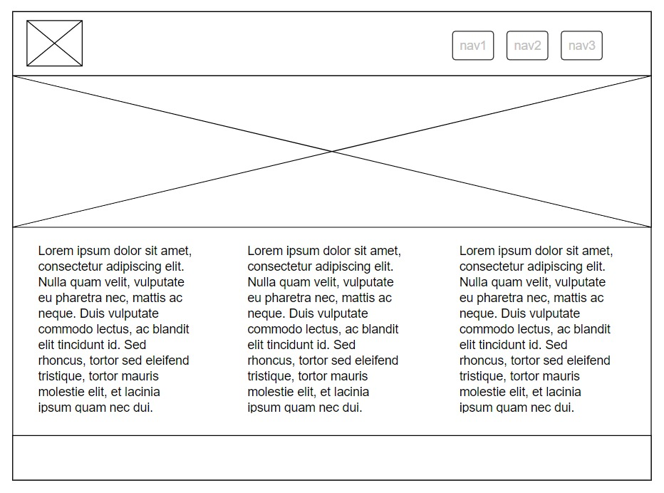
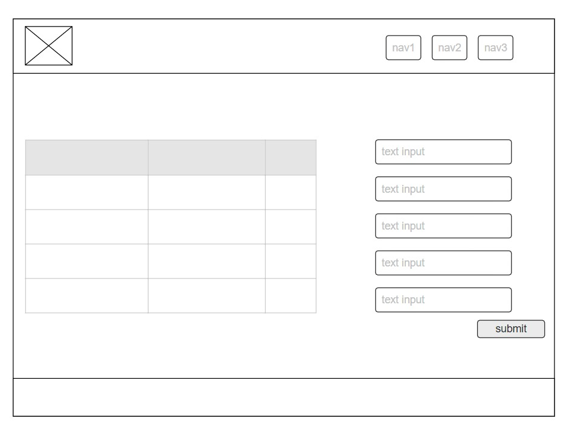
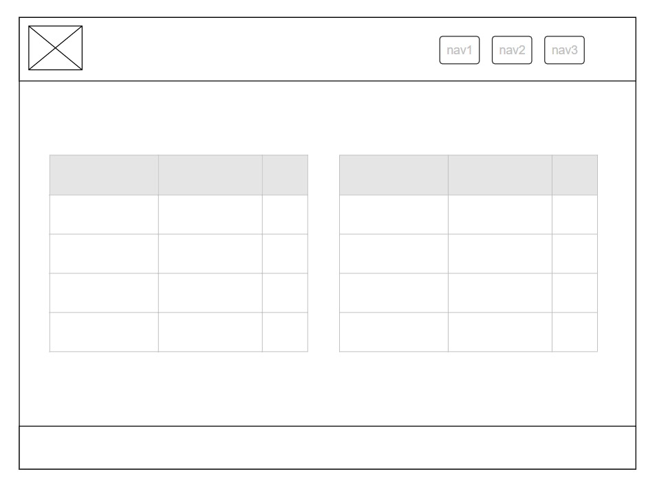
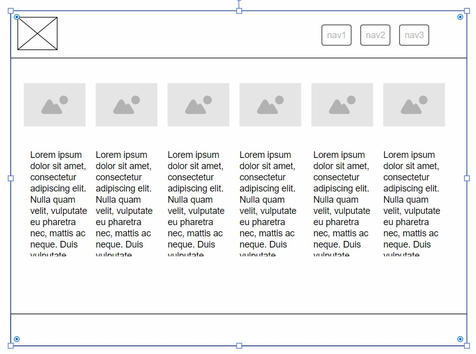

# salary-management

# WIRE FRAMES

> home 

> daily 

> monthly 

> monthly 

> about 

# user story:
## monthly spendings

1- As a user I want to have a monthly table so that I can know my monthly spendings

## daily spendings

2- As a user I want to have a daily income spending so that I can be aware of my daily expenses

## helping you file taxes

3- As a user I want to keep all of my financial data in one location so that I can be accurate when I file my taxes

## chart view

4- As a user I would like to have my monetary transactions  organized  in a chart for comparison so that I can understand them easily

## privacy

5- As a user I want to have the privacy of storing my sensitive information without anyone accessing them but me

---

# Software requirements
our vision is to be the leading banking app in the MENA region, our product will save you as a consumer from the headache of keeping track of your spendings by telling you what you spent and where you spent it, and if you can manage your income correctly that means you can have the peace of mind of having no money lost

# Functional requirements
Our main feature is keeping your monetary stored on monthly and daily basis, and of course you can add, delete, modify and access your secured data at any given time

# domain modeling

